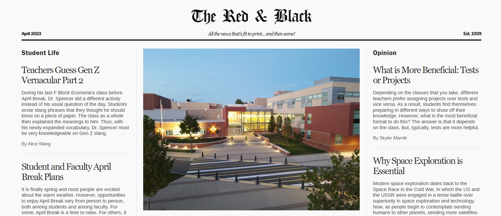
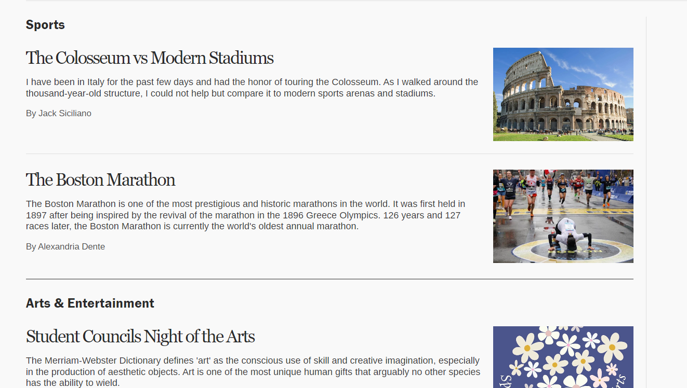
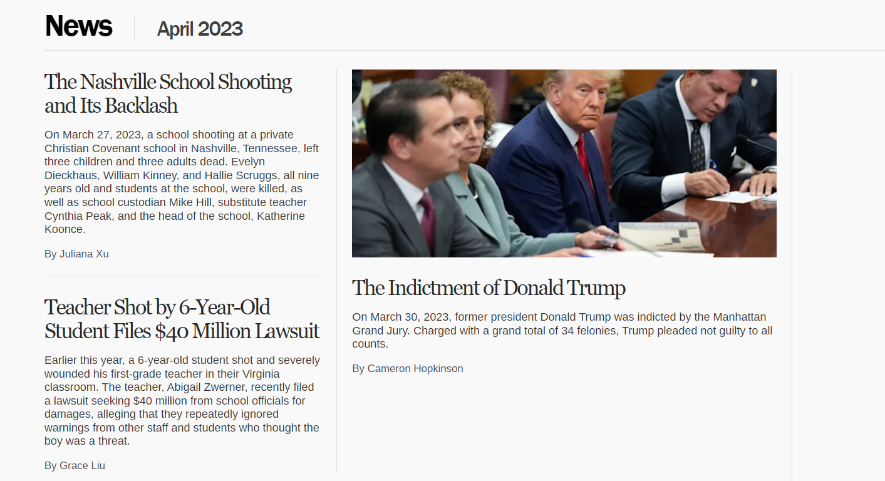
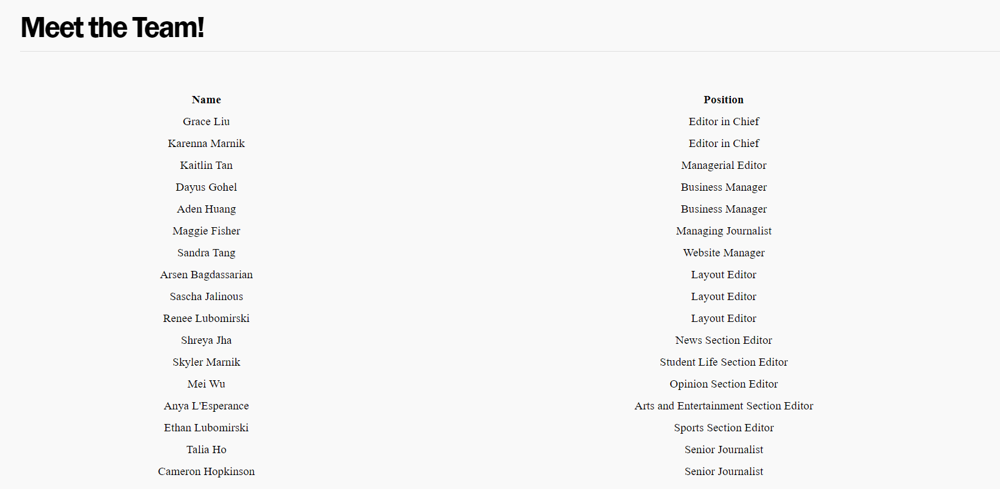

## Overview 


During my time as Website Manager for The Red & Black, our school’s student-run newspaper, I maintained and updated a dynamic website that published over 20 new articles each month. Each article, written by different student contributors, needed to be properly categorized, formatted, and displayed in a clean and readable format.



To manage this at scale, I built and maintained a MySQL database that stored all article metadata, including titles, authors, timestamps, and full content. I wrote scripts in JavaScript to process and upload article content, and created SQL queries to retrieve and display the correct articles on the site, organized by issue and category. The frontend interface was built to reflect the layout of a traditional newspaper, while remaining accessible and responsive.

Unfortunately, it is no longer being hosted on any server and is not deployed for the public. 

## Tech Stack 
- Languages: JavaScript, SQL
- Database: MySQL
- Backend: Custom scripts to ingest and update content
- Frontend: Static HTML/CSS with dynamic content injection via JavaScript
- Deployment: School-hosted server environment

## Key Features 
- Automated Article Uploads:
Wrote scripts that parsed and inserted new article submissions into the SQL database, including title, body, author, publish date, and issue metadata.

- Dynamic Rendering:
Used JavaScript to dynamically retrieve and display articles from the database on each page, grouped by category or issue.

- Monthly Publication Pipeline:
Maintained a consistent monthly workflow to publish new articles, troubleshoot formatting issues, and ensure all content appeared correctly on the site.

- Legacy Code Refactoring:
Improved code readability and reorganized backend scripts to make the workflow easier for future developers to maintain.

## More Images 

