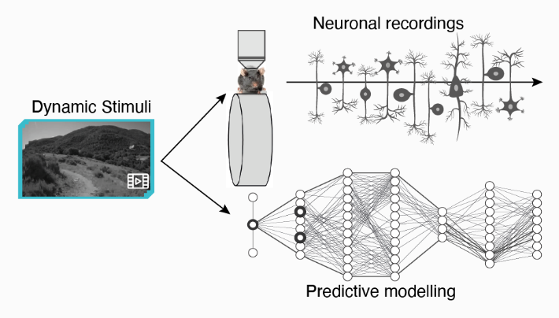

## Overview


A deep learning model leveraging ViViT and qLoRA to predict neuronal firing patterns in mice based on dynamic video stimuli.



This research project builds a machine learning pipeline for decoding murine neural activity from naturalistic video input. The core of the system is a fine-tuned Video Vision Transformer (ViViT) that has been adapted to learn temporal and spatial patterns associated with neural responses.

## Motivation
Understanding how the brain processes visual information is a central question in neuroscience. By using deep learning to model the connection between visual stimuli and recorded neuronal activity, this project explores a scalable and data-driven approach to mapping visual encoding.

## Key Features 
- ViViT-based Architecture: Utilizes google/vivit-b-16x2-kinetics400 pretrained transformer for video frame processing.
- Custom Reducer Module: Downsamples high-dimensional transformer embeddings into a fixed-length sequence using 1D convolution.
- Swappable Classifier: Supports multi-mouse prediction with dynamically selected classifier heads per subject.
- qLoRA Fine-Tuning: Efficient low-rank adaptation to scale model training across large neural datasets.
- Multi-modal Data: Incorporates pupil tracking and behavior metadata alongside neural responses for richer prediction contexts.
- Sensorium Dataset: Trained on real murine neural recordings and synchronized video stimuli from the Sensorium 2023 benchmark.

## Technical Stack
- Frameworks: PyTorch, HuggingFace Transformers, PEFT, BitsAndBytes
- Model: ViViT Transformer with custom SensoriumVivitForVideoClassification extension
- Training: LoRA + 4-bit quantized layers for memory efficiency
- Dataset: Sensorium 2023 murine video-response recordings
- Logging: Integrated with Weights & Biases (WandB) for loss tracking and model checkpoints

## Code snippet 
```python
# Load and preprocess video frames
frames = preprocess_frames('path_to_video/')

# Load model
model = SensoriumVivitForVideoClassification.from_pretrained(...)

# Predict neuronal activity
predictions = model.predict(frames)
```

## Performance
While still in development, the model achieves promising correlations between predicted and recorded neuronal activity across multiple mice. Further optimization is underway for reducing overfitting and extending to generalization across unseen subjects.

There is no frontend display for this project, as it was mostly research based. 


  


