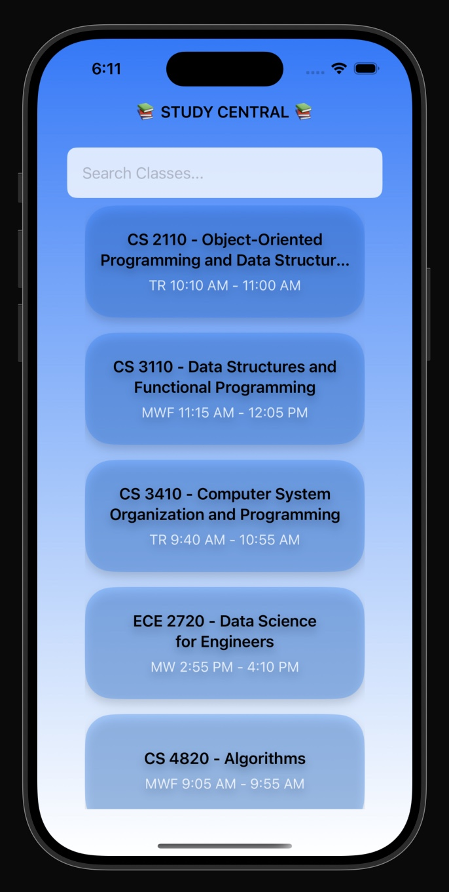

## Overview 

StudyCentral is an open-source resource-sharing app designed for Cornell students to streamline their study preparations.


It allows users to add topics and share resource links for each prelim in every course. The app fosters collaboration and provides centralized access to all study materials in an intuitive and easy-to-use interface.

The backend is built using Flask (Python), while the frontend is developed in XCode using Swift for a seamless and user-friendly experience.

The backend is containerized using Docker, ensuring consistent deployment and simple setup across any environment. The app is currently deployed and accessible at:
http://34.48.134.152/

## Features

- Course Management: Create and view courses with detailed information, including descriptions, schedules, and prerequisites.
- Prelim Tracker: Add prelims associated with specific courses, complete with titles and dates.
- Resource Sharing: Add and view study topics along with resource links for each prelim.
Frontend Features:
- Intuitive UI for managing courses, prelims, and resources.
- Mobile compatibility for on-the-go study planning.
- Easy navigation with dedicated sections for courses, prelims, and topics.
- Seamless API Functionality: Offers a robust backend for managing courses, prelims, and topics through well-structured API routes.
- Dockerized Backend: Ensures portability, scalability, and ease of deployment.

## iOS 
### Multiple screens
We had our main screen which displayed the different courses. Users were then able to click on a course, which took them to another screen with the detailed information like prereqs, course description, and all the different resources for each prelim, along with the option to add a topic and link for a certain prelim in the course.
### Scrollable views 
We had a view with vertical scrolling that displayed all the courses. Then in each view with the detailed information we had a view with horizontal scrolling that displayed all resources for each prelim.
### Networking integration
We fetched the courses from the backend. We also fetched the prelims for each course, which then had resources associated to that prelim. We also had a function where the user could post a new resource (topic and link) associated with a specific prelim.

## Tech Stack
- Backend: Flask (Python)
- Database: SQLite
- Frontend: XCode (Swift)
- Containerization: Docker
- Hosting: Google Cloud VM

## Screenshots 

  

  

  

